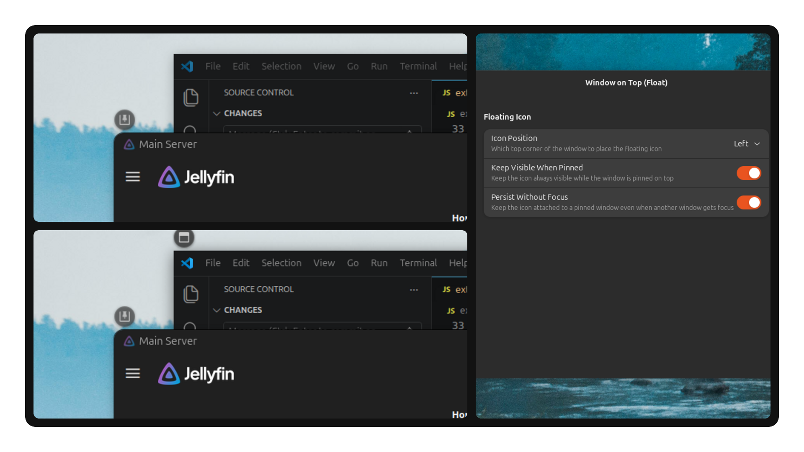

# Window on Top (Float)

Window on Top (Float) is a GNOME Shell extension that adds a floating circular button near the top edge of each non-maximized window for toggling Always on Top. Instead of a static panel indicator, the button appears only when the cursor approaches the window corner and fades away when it leaves.

It is built for people who want quick always-on-top control without a permanent panel button taking up space.



## Why This Extension

The original [Window on Top](https://github.com/uosyph/window-on-top) extension places a toggle in the top panel. This fork replaces that with a floating, proximity-triggered button that attaches directly to each window, keeping the panel clean and the interaction contextual.

The goal is simple:

- toggle always-on-top without leaving the window context
- keep the interface minimal and non-intrusive
- support multiple pinned windows simultaneously

## Highlights

- Floating circular button above the window frame, never covering content
- Proximity-based reveal with smooth fade animations and hysteresis to prevent flickering
- Multi-window support with independent buttons for every tracked window
- Left or right positioning via preferences
- Persistent visibility option for pinned windows
- Optional persistence without focus so pinned windows keep their button even when another window is focused
- Automatic light and dark theme adaptation using the system color scheme
- Hidden during overview (Activities) mode
- Per-workspace awareness with minimized window handling

## Preferences

The preferences window exposes the following controls:

- `Icon Position`
  Choose whether the floating button appears at the top-left or top-right corner of each window
- `Keep Visible When Pinned`
  When enabled, the button stays visible on pinned windows without needing mouse proximity
- `Persist Without Focus`
  When enabled, the button stays attached to a pinned window even when another window receives focus

## Compatibility

The extension targets GNOME Shell `45` through `49`.

## Installation

### From Extensions.gnome.org

Once published, install it directly from Extensions or Extension Manager.

### From Source

Build the extension bundle:

```bash
make build
```

Install it into the local user extension directory:

```bash
make install
```

On X11, reload GNOME Shell after changes:

1. Press `Alt+F2`
2. Type `r`
3. Press `Enter`

On Wayland, log out and log back in.

## Project Structure

- `src/extension.js` contains the runtime behavior, window tracking, proximity detection, and theme adaptation
- `src/prefs.js` provides the preferences UI
- `src/schemas/org.gnome.shell.extensions.window-on-top.gschema.xml` defines the settings schema
- `src/icons/` contains the symbolic SVG icons for pinned and default window states
- `Makefile` builds the release zip and installs the extension locally

## Attribution

This project is a fork of the original Window on Top extension:

- Original extension: <https://github.com/uosyph/window-on-top>
- GNOME Extensions page: <https://extensions.gnome.org/extension/6619/window-on-top/>

## License

This project is distributed under the terms of the GNU General Public License, version 2 or later.
